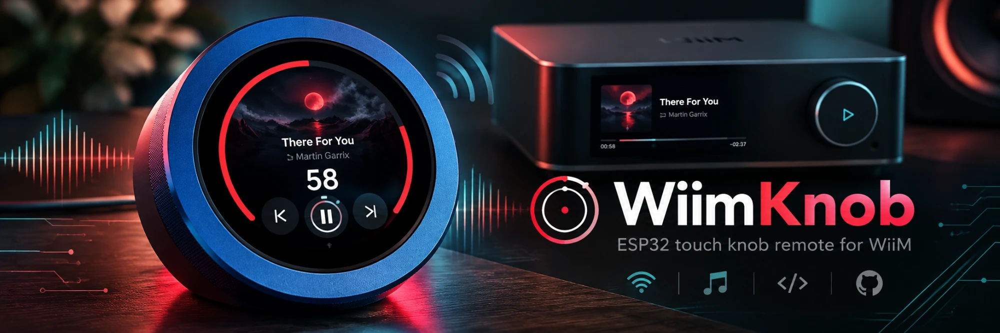
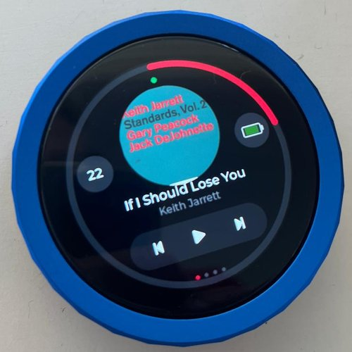
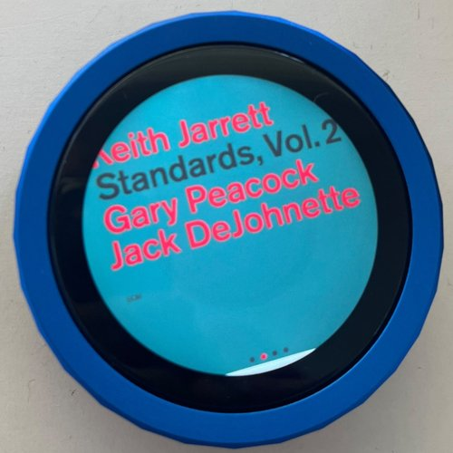
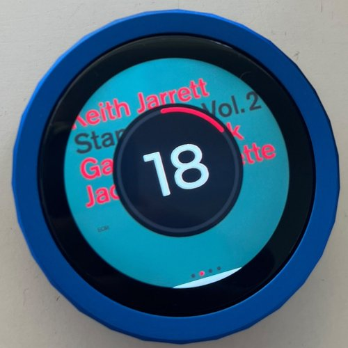
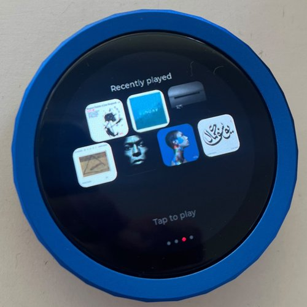
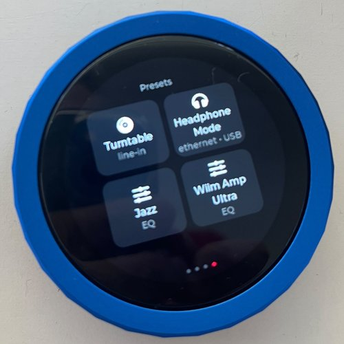
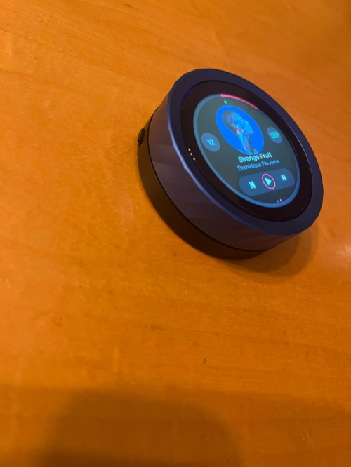

# WiimKnob



Firmware for the [Waveshare ESP32-S3-Knob-Touch-LCD-1.8](https://www.waveshare.com/esp32-s3-knob-touch-lcd-1.8.htm)
that turns it into a small WiiM remote:

- Turn the knob to change volume, with a light haptic buzz on taps (buttons, presets, albums)
  via the board's DRV2605L driver.
- Four swipeable screens, left to right:
  1. **Controls**: a circular art inset, title/artist, a transparent pill holding the
     prev/play-pause/next controls, a plain-number volume badge, and a battery-shaped gauge.
  2. **Now playing**: full-screen album art. Turning the knob shows the volume in big digits
     with a red ring (fades a second after you stop); double-tap anywhere to play/pause.
  3. **Recently played**: the last 10 albums as thumbnails (rows of 3-4-3). Tap one to play it
     again. See **Recently played** below.
  4. **Presets**: your WiiM Home presets as tiles, named and described by what each one does
     (switch input, output, EQ). Tap one to fire it. See **Presets** below.
- A red ring around the edge of the controls screen shows the current volume, matching the
  knob. Everything else is neutral (dark buttons, white icons) so that accent doesn't get lost
  in the noise; red also marks the last tapped preset/album.
- Tap the battery icon to flip it to a plain percentage (tap again to flip back); it pulses
  while charging is detected.
- Power-aware: the screen dims out after a short idle timeout (the knob still works while it's
  off, and LVGL itself stops redrawing to save CPU/SPI time), and the whole board deep-sleeps
  after a longer one, waking on a touch or knob turn. Double-tapping the dark screen
  plays/pauses without waking it.
- Handles accented/non-ASCII track and artist names correctly (see **Fonts** below) — the
  stock LVGL fonts only cover plain ASCII.

This is a first working version, not a finished product — see **Ideas for next steps** below.

## Screenshots

<table>
<tr>
<td align="center"><br><sub>1. Controls</sub></td>
<td align="center"><br><sub>2. Now playing</sub></td>
<td align="center"><br><sub>2. Turning the knob</sub></td>
</tr>
<tr>
<td align="center"><br><sub>3. Recently played</sub></td>
<td align="center"><br><sub>4. Presets</sub></td>
<td align="center"><br><sub>The hardware</sub></td>
</tr>
</table>

## Hardware background

Waveshare hasn't published a pinout or demo code for this board (its wiki page is a
placeholder as of writing). Everything in `include/Pins.h` and `src/display/PanelInit.h` comes
from a community reverse-engineering effort that measured the schematic and factory firmware
directly:
https://github.com/teetotum-rs/firmware/blob/main/docs/hardware/

Two things worth knowing going in:

1. **The board has two microcontrollers.** The ESP32-S3 (which this firmware runs on) owns the
   display, touch and one of the two physical encoders on the shaft. A second, classic ESP32
   owns the audio DAC, classic Bluetooth, and forwards knob turns to a *second* logical encoder.
   This project only uses the ESP32-S3 side — we don't need the board's own audio output since
   WiiM is doing the actual audio playback.
2. **The knob is not a quadrature encoder.** Each direction pulses its own GPIO low (one pulse
   per detent, 30 per revolution) rather than two lines in quadrature. `src/input/Knob.cpp`
   decodes it by sampling the pin levels, not by counting edges -- see **Knob and screen
   responsiveness** below for why.

## WiiM API

Uses WiiM's local HTTP API (`https://<device-ip>/httpapi.asp?command=...`), documented at
https://cvdlinden.github.io/wiim-httpapi/ and in WiiM's own PDF. It's HTTPS with a self-signed
certificate and only reachable on your LAN, so the firmware skips certificate validation
(`WiFiClientSecure::setInsecure()`) rather than trying to pin a cert that isn't meant to be
verified against a public CA.

Commands used: `getPlayerStatus` (play state, volume), `getMetaInfo` (title/artist/album/cover
URL), `setPlayerCmd:vol:<0-100>`, `setPlayerCmd:onepause`, `setPlayerCmd:next`,
`setPlayerCmd:prev`, `MCUKeyShortClick:<n>` (fire preset n), `getAllRoutines` and
`getStatusEx` (preset details, see **Presets**). Presets and recently played also use the
WiiM's UPnP `PlayQueue` service (plain HTTP on port 49152): `GetKeyMapping`, `BrowseQueue`,
`CreateQueue`, `PlayQueueWithIndex`.

All WiiM networking runs on two FreeRTOS tasks (`src/wiim/WiimTask.cpp`), pinned away from the
core that drives the display/touch/knob loop, so a slow or stalled network call can't freeze
the UI. One task only sends what you just did (buttons, presets, albums, volume) and polls
play state; everything slow (metadata, album art download, saving recently played albums,
refreshing presets) runs on the other. With a single task, a tap could sit queued behind a
multi-second album art download.

Two things about the connection itself:

- **Keep it open, and retry once.** A fresh TLS handshake costs 400-700ms on this CPU, so each
  task keeps a long-lived `WiFiClientSecure`/`HTTPClient` pair open across calls. The WiiM's
  web server drops idle keep-alive connections after ~5-10s, and a request that hits a
  just-closed one fails before the WiiM ever sees it, so those get retried once on a fresh
  connection. The command task's status poll (every 1.2s) is also what keeps its connection
  warm.
- **Only two TLS sessions at a time.** Each one pins ~40KB of internal RAM (this framework
  build can't put mbedTLS buffers in PSRAM). The background task closes its own connection
  before downloading album art, which needs a third.

On reuse (see the big comment in `WiimClient.h`): **both** objects have to be
persistent, not just the socket. `HTTPClient`'s destructor unconditionally closes its
connection, so a fresh `HTTPClient` per call — even one that reuses the same
`WiFiClientSecure` — silently undid the keep-alive every time; every request paid a full TLS
handshake (measured at 400-700ms on this CPU) instead of the ~15-45ms a genuinely reused
connection costs. That was the actual cause of the multi-second lag on volume/prev/next/pause
in early versions of this firmware, not the network or the WiiM itself.

## Presets

The WiiM's own `getPresetInfo` reports zero presets on this firmware generation: presets are
now "routines", lists of steps (switch input, switch output, load an EQ, set the subwoofer)
stored on the device. The presets screen reads which routine sits in each slot (UPnP
`GetKeyMapping`), joins that with the routine definitions (`getAllRoutines`), and labels each
tile by what it does: input first (`line-in`, or `ethernet`/`wi-fi` for network streaming,
depending on how the WiiM is connected), then a USB DAC output, otherwise just `EQ`. Tapping a
tile sends `MCUKeyShortClick:<slot>`, the same as pressing it in the WiiM Home app.

The list is read at boot and refreshed every 5 minutes, so edits in the app show up on their
own. The WiiM doesn't store preset artwork locally and doesn't report which preset is in
effect, so the red border marks the last preset fired from the knob, not the "active" one.

## Recently played

The WiiM Home app's recently played list lives in WiiM's cloud, not on the device, so the
knob keeps its own. Whenever a new album starts playing from a queue on the WiiM, the knob
saves a copy of that queue (`BrowseQueue`) plus a 68px thumbnail to flash (LittleFS, on the
`spiffs` partition), so the list survives deep sleep and reboots. Tapping a thumbnail hands the
saved queue back (`CreateQueue`) and starts it from the first track (`PlayQueueWithIndex`).
`ReplaceQueue` looks like the right call but only swaps a queue that's already loaded, so it
silently restarted the current album instead.

Limits worth knowing:

- **Only sources that play from a queue on the WiiM show up**: albums started from the WiiM
  Home app (Plex, Qobuz, etc.). Connect-style sources (Qobuz Connect, Spotify Connect, TIDAL
  Connect, AirPlay) stream from another app with no device-side queue, so there's nothing to
  save or replay.
- **Streaming links can expire.** Qobuz stream URLs in a saved queue carry an expiry time
  (hours out); Plex links point at your own server and don't. An old Qobuz entry may fail to
  replay.
- **Saved queues include whatever the WiiM had in them**, which for Plex includes the server's
  access token. They stay in the knob's flash and are never logged.

## Knob and screen responsiveness

Fast knob spins used to lag well behind the hand. Two separate causes, both measured on-device:

- **The knob was losing detents.** The first decoder counted falling edges in a GPIO interrupt
  with a 5ms per-line debounce. On a fast spin the edges ring, and both lines sometimes dip
  together for a moment: logging showed ~85% of edges being discarded, and the both-low dips
  counting as one clockwise *plus* one counter-clockwise detent, which cancel out. The decoder
  now samples both pins every 1ms on an `esp_timer`, only trusts a level that's held for 2ms,
  counts a detent when exactly one line is low after the knob was idle, ignores both-low, and
  needs a return to idle before the next detent. (The community teardown saw the same thing:
  edge counting gave 37-41 per revolution, polling the levels exactly 30.)
- **Redraws were slow.** Measured with a simulated fast spin (a detent every 15ms on the
  full-screen art page), the volume readout went from 21.5 fps with 86ms from detent to
  screen, to ~43 fps and ~19ms. What made the difference:
  - Restarting the readout's fade on every detent touched its opacity, which marks the whole
    210px circle dirty. Now only the digits and the changed slice of the ring redraw, and a
    timer starts the fade once the knob has been still for a second (this alone halved the
    per-frame cost).
  - A knob turn redraws immediately (`lv_refr_now`) instead of waiting for LVGL's next refresh
    tick, and that tick is 15ms instead of 30ms.
  - Album art is decoded at the screen's full 360px, so the full-screen page draws it 1:1
    instead of software-scaling it on every redraw.
  - The readout's circle is opaque: blending a translucent one over the art cost ~5ms of each
    ~20ms frame.
  - `loop()` re-applies the WiiM's play state, connection and volume every pass; the UI now
    skips values that haven't changed instead of re-laying out text and refreshing styles.

Things that measured as *not* worth it: moving LVGL's draw buffers from PSRAM to internal RAM
(no gain), and the QSPI flush itself (~4.5ms of a frame).

## Power management

Two independent timeouts, both configurable in `Config.h`, both reset by any touch or knob
turn:

- **`SCREEN_TIMEOUT_S`** (default 30s): turns the backlight off. Everything else keeps running
  normally — WiFi stays connected, polling continues, and turning the knob still changes volume
  (and turns the backlight back on so you can see the new level). This tier only saves the
  backlight's own draw. While it's dark, a double-tap toggles play/pause (with a haptic buzz)
  and leaves the screen off; a single tap wakes it, ~350ms later than it otherwise would,
  since it has to wait to see whether a second tap is coming.
- **`DEEP_SLEEP_TIMEOUT_MIN`** (default 10 min): puts the whole board into deep sleep, which cuts
  WiFi and the CPU too — the largest lever for battery life. A touch or knob turn wakes it by
  pulsing one of three GPIOs the chip watches for while asleep (see `src/power/Power.cpp`); no
  extra wiring needed, since the knob and touch controller already pulse those pins low as part
  of normal operation. Waking from deep sleep is a full reboot, so it takes a few seconds to
  reconnect to Wi-Fi and re-fetch state — "fairly easy" but not instant.

Deep sleep intentionally does not try to preserve any state (in-flight volume changes, current
track, etc.) — the display and WiiM state just repopulate over the first second or two after
wake, the same as a normal boot.

## Haptics

The board has a DRV2605L LRA haptic driver on the touch controller's I2C bus (address `0x5A`),
enabled via GPIO38. Per the community research this project relies on for its pinout, the chip
answers on I2C regardless of that pin's state but its output stage stays off — and everything
feels like no motor is attached — until GPIO38 is driven high. `src/haptics/Haptics.cpp` enables
it, configures the driver for LRA playback (not the ERM default), and fires a short "click"
effect on every prev/play-pause/next tap, preset or album tap, and double-tap play/pause. It deliberately skips the DRV2605L's calibration
registers (rated voltage, overdrive clamp, auto-cal) — the ROM-library default felt effect
works fine on this board without them, and getting those wrong is how you end up silently
over-driving the actuator.

## Fonts

The stock LVGL `lv_font_montserrat_16`/`_20` only include ASCII plus the icon symbols — verified
directly from their compiled-in glyph range tables, not assumed. Any accented character (é, ö,
ñ, etc., e.g. in a track or artist name) had no glyph to draw at all. `src/ui/fonts/` has two
regenerated replacements (`lv_font_montserrat_16_latin`/`_20_latin`, used for the title/artist
labels only) built from the same Montserrat-Medium.ttf + FontAwesome5 symbol set LVGL's own
build uses, with the main range extended to cover Latin-1 Supplement and Latin Extended-A
(`0x20-0x7F,0xA0-0x17F,0x2022`) — enough for French, German, Spanish, Nordic, Polish, Czech,
and most other Western/Central European text. The exact `lv_font_conv` command is in each
file's own header comment if you need to extend the range further (e.g. for Cyrillic or Greek).

Two more generated fonts live alongside them: `lv_font_montserrat_96_digits` (just 0-9, for the
big volume readout -- LVGL's built-in fonts stop at 48px) and `lv_font_preset_icons_26` (four
FontAwesome glyphs for the preset tiles).

## Battery gauge

The controls screen shows a real battery-shaped icon (not just bars) with a proportional,
color-coded fill, next to the plain-number volume badge. This board has no fuel-gauge chip and
no confirmed charger-status pin, so both pieces of this are estimates, not hard readings — see
the comments in `src/power/Battery.h`/`.cpp`:

- **Level**: read from `BATTERY_ADC_PIN` (GPIO1, a community-documented but Waveshare-unverified
  candidate for the battery sense pin) and converted through `BATTERY_DIVIDER_RATIO` and a
  generic LiPo voltage curve. Both the pin and the ratio need calibrating against a multimeter
  reading of your actual battery — the raw voltage is logged over serial every poll
  (`[battery] ...`) specifically so you can do that.
- **Charging**: there's no status pin, so this is inferred by watching for a sustained rising
  voltage trend across consecutive readings. It can occasionally misfire (e.g. right after a
  load spike recovers) — good enough for "does this look like it's charging", not a precise
  signal.

An earlier version of this firmware had a separate battery detail screen (percentage, time
estimate, raw voltage) — it's been folded into the single gauge on the controls screen instead.

## Setup

1. Copy `include/Config.h.example` to `include/Config.h` and fill in your Wi-Fi credentials and
   your WiiM's IP address (find it in the WiiM Home app under Device Info; a static DHCP
   reservation on your router means you won't need to update this later).
2. Install [PlatformIO](https://platformio.org/). **This needs Python 3.10 or newer** — the
   platform this project uses (see below) refuses to run under older Python. If your default
   `python3` is older (macOS ships 3.9 by default), install a newer one (e.g. `brew install
   python@3.11`) and create a venv for PlatformIO with it:

   ```bash
   python3.11 -m venv ~/.platformio-venv
   ~/.platformio-venv/bin/pip install platformio
   ```

   Use `~/.platformio-venv/bin/pio` in place of `pio` below (or add it to your `PATH`).
3. Build and upload:

   ```bash
   pio run -e esp32-s3-knob -t upload
   ```

   To flash: hold the **BOOT** button on the ESP32-S3R8 side, plug in via USB-C, then release.
   The Type-C port routes to either the ESP32-S3's native USB or the USB-UART bridge depending
   on cable orientation (per Waveshare's product page) — if upload doesn't find the port, try
   flipping the cable.

4. Open the serial monitor (`pio device monitor`) to watch it connect to Wi-Fi and start
   polling.

   If upload fails with "This chip is ESP32, not ESP32-S3", the cable orientation reached the
   board's other microcontroller (nothing gets written): flip the USB-C plug at the board. If
   it fails with "No serial data received", the board is probably in deep sleep or stuck:
   unplug, hold **BOOT**, plug back in, release.

If the screen stays dark or PSRAM isn't detected at boot, check `platformio.ini`'s
`board_build.arduino.memory_type` / `board_build.psram_type` against what `esptool.py
flash_id` reports for your specific board revision — these straps are inferred from the
product page spec (16MB quad flash, 8MB octal PSRAM on the ESP32-S3R8 module) but Waveshare
could ship a revision with different wiring.

## Project layout

```
include/
  Pins.h            board pinout
  Config.h.example  Wi-Fi + WiiM settings template (copy to Config.h)
  lv_conf.h         LVGL configuration
src/
  main.cpp          setup/loop: Wi-Fi, polling, input wiring
  display/          QSPI bus + ST77916 panel bring-up, LVGL display driver glue
  haptics/          DRV2605L LRA haptic feedback
  input/            knob (pulse decoding) and touch (CST816D) drivers
  power/            screen-timeout + deep-sleep idle management, battery estimate
  wiim/             WiiM HTTP/UPnP client, the two network tasks, album art JPEG
                    fetch/decode, and the recently played history
  ui/               the four-screen LVGL layout and gesture navigation
    fonts/            regenerated fonts with accented-character support (see Fonts above),
                      plus a small icon font for the preset tiles
```

## Ideas for next steps

- **Auto-discovery**: currently the WiiM's IP is hardcoded in `Config.h`. mDNS/SSDP discovery
  would remove that step.
- **Backlight dimming**: `display::setBacklight()` is on/off only; the backlight pin (GPIO47)
  is PWM-capable if you want to add a brightness setting or auto-dim.
- **Multiroom awareness**: the WiiM API exposes multiroom group info; the UI doesn't show or
  control it yet.
- **Charging detection is a voltage-trend guess** (see the Battery gauge section) because this
  board has no confirmed charger-status pin. If you find one by probing the charge IC directly,
  wiring it to a GPIO and reading it would be far more reliable than the current heuristic.
- **Play/pause state for Connect sources**: Qobuz Connect reports its status as "none"
  whether playing or paused, so the knob infers it from whether the track position is moving
  (the icon catches up ~2s after pausing). Other Connect sources may behave the same way.
- **Wider Unicode coverage**: the regenerated fonts (see Fonts above) cover Western/Central
  European accents but not Cyrillic, Greek, or CJK — extend the `lv_font_conv` range if you
  need those.
